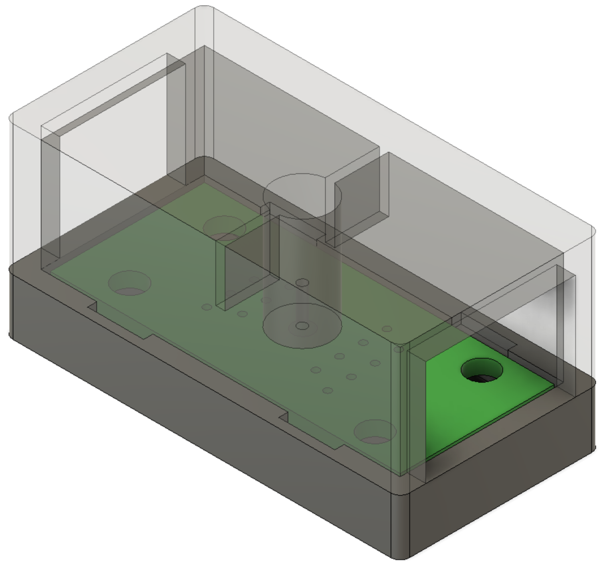

# RJ12-to-RJ45 Converter

## Pictures

## Dimensions
The enclosure measures approximately 41 x 22 x 20 mm.

## Print Settings
Print both parts in PETG at 0.2 mm layer height with 100% infill.

## Post processing
Clean-up both parts, and adjust the small 'tabs' with a file, so that both
halves fit. They can then be clamped together with a small M2 self-tapping
screw.
